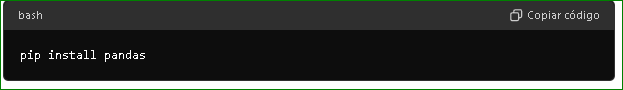
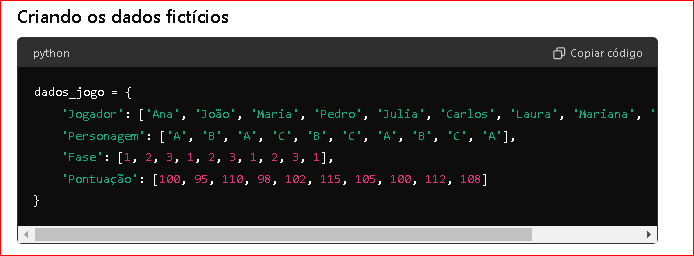
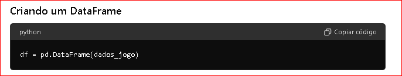
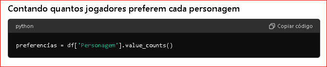
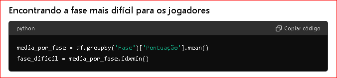

Como Utilizar Pandas para Transformar Dados em Insights Poderosos

Bem-vindo ao mundo fascinante dos pandas! E não, não estamos falando dos ursos fofinhos que adoram bambu, mas sim do Pandas, a biblioteca mágica do Python que faz a análise de dados parecer brincadeira de criança. Neste artigo, vamos mostrar como essa ferramenta incrível pode transformar números chatos em histórias super legais. Vamos explorar como contar quantos jogadores preferem cada personagem em um jogo e descobrir qual fase é a mais desafiadora. Então, prepare-se para uma aventura divertida e cheia de insights no mundo da análise de dados com Pandas! 🚀

## Em primeiro lugar, vamos falar o que é o Pandas?

O Pandas é como uma caixa de ferramentas mágica para cientistas de dados. Ele te ajuda a organizar e mexer com dados de um jeito que faz parecer super fácil. Por exemplo, imagine que você tem uma lista gigante de notas de provas de uma turma. Com o Pandas, você pode ver quem tirou as notas mais altas ou mais baixas rapidinho!

### O insights de utilização

#### Como o Pandas ajuda a encontrar padrões?
O Pandas pode mostrar padrões escondidos nos dados. Por exemplo, você tem dados de vendas de uma loja ao longo do ano. Com Pandas, você pode descobrir qual foi o mês em que a loja vendeu mais produtos ou qual foi o dia mais movimentado da semana.

#### Transformando dados para contar histórias
Com o Pandas, você pode transformar números chatos em histórias interessantes. Por exemplo, se você tem dados de um jogo, Pandas pode te mostrar quantos jogadores preferem cada personagem ou qual fase do jogo é mais difícil para os jogadores.

### Agora como seria transformar a história em código, vamos lá !!

#### Vamos passo a passo 


<b><p style="color:Tomato; font-size:100%;">Antes de começar !</p></b>

Antes de começarmos, você precisará usar o Python, seja dentro do Google Colab ou instalando no seu computador. Não se preocupe, é bem fácil! Se você optar pelo Google Colab, basta acessar [Google Colab](https://www.python.org/downloads/) e começar a usar Python diretamente no navegador, sem precisar instalar nada.

Se preferir instalar Python no seu computador, você pode seguir estes passos:

Acesse o site oficial do Python: [Python.org.](https://www.python.org/downloads/)
Baixe a versão mais recente e siga as instruções de instalação para o seu sistema operacional.
Após a instalação, você também precisará instalar o Pandas. Abra o terminal (ou Prompt de Comando) e digite:



<h4 style="color:Tomato;text-align:left;">Só lembrando:</h1>
<p style="text-align:left;"> Vale lembrar que além deste exemplo o Pandas vai mais além é amplamente utilizado para manipulação e análise de dados em Python. Além de criar DataFrames como no exemplo, também pode ser usado para ler arquivos CSV, Excel, SQL, entre outros, e manipular grandes conjuntos de dados de maneira eficiente.</p>

Pronto! Agora você está preparado para mergulhar na análise de dados com Pandas! 🚀

<div>
<p></p>

Aqui abaixo temos o codigo, iremos falar sobre cada ponto, bora lá !

<head>
    <meta charset="UTF-8">
    <meta name="viewport" content="width=device-width, initial-scale=1.0">
    <title>Exemplo de Código</title>
    <style>
        .code-box {
            border: 1px solid #ccc;
            padding: 10px;
            background-color: #f9f9f9;
            font-family: monospace;
            white-space: pre;
            overflow: auto;
        }
    </style>
</head>

    <div class="code-box">
        import pandas as pd

        # Exemplo de dados fictícios de um jogo
        dados_jogo = {
            'Jogador': ['Ana', 'João', 'Maria', 'Pedro', 'Julia', 'Carlos', 'Laura', 'Mariana', 'Felipe', 'Sofia'],
            'Personagem': ['A', 'B', 'A', 'C', 'B', 'C', 'A', 'B', 'C', 'A'],
            'Fase': [1, 2, 3, 1, 2, 3, 1, 2, 3, 1],
            'Pontuação': [100, 95, 110, 98, 102, 115, 105, 100, 112, 108]
        }

        # Criando um DataFrame com os dados
        df = pd.DataFrame(dados_jogo)

        # Contando quantos jogadores preferem cada personagem
        preferencias = df['Personagem'].value_counts()

        # Mostrando a contagem de preferências
        print("Quantidade de jogadores por personagem:")
        print(preferencias)
        print()

        # Encontrando a fase mais difícil para os jogadores
        media_por_fase = df.groupby('Fase')['Pontuação'].mean()
        fase_dificil = media_por_fase.idxmin()

        # Mostrando a fase mais difícil
        print(f"A fase mais difícil para os jogadores é a fase {fase_dificil}")
    </div>

<b><p style="color:MediumSeaGreen;font-size:135%;" >Passo 1)</p><p>

## Criando os dados fictícios


<h4 style="color:Tomato;text-align:left;">Detalhe: </h1> dados_jogo é um dicionário Python que contém quatro listas correspondentes aos dados dos jogadores, personagens, fases e pontuações.

<h4 style="color:Tomato;text-align:left;">Outras aplicações: </h1>Pandas permite a criação de DataFrames não apenas a partir de dicionários, mas também de listas, arrays NumPy, e até de consultas a bancos de dados. Isso é útil em projetos de análise de dados que requerem importação e estruturação de dados de diversas fontes.

<b><p style="color:MediumSeaGreen;font-size:135%;" >Passo 2)</p><p>

## Criando um DataFrame


<h4 style="color:Tomato;text-align:left;">Detalhe: </h1>
pd.DataFrame() converte o dicionário dados_jogo em um DataFrame do Pandas chamado df.

<h4 style="color:Tomato;text-align:left;">Outras aplicações: </h1> Além de criar DataFrames a partir de dicionários, Pandas permite a concatenação de múltiplos DataFrames, junção de tabelas, e reshaping (mudança de formato) de dados, facilitando a organização e análise de grandes volumes de informações estruturadas.

<b><p style="color:MediumSeaGreen;font-size:135%;" >Passo 3)</p><p>

## Contando quantos jogadores preferem cada personagem


seleciona a coluna 'Personagem' do DataFrame df, e .value_counts() conta quantas vezes cada valor aparece nessa coluna.

<h4 style="color:Tomato;text-align:left;">Outras aplicações: </h1>Esta função é útil para análise de frequência de dados categóricos, como preferências de produto em vendas, categorias de clientes em marketing, entre outros.

<b><p style="color:MediumSeaGreen;font-size:135%;" >Passo 4)</p><p>

## Encontrando a fase mais difícil para os jogadores



<h4 style="color:Tomato;text-align:left;">Detalhe: </h1>
 df.groupby('Fase')['Pontuação'].mean() agrupa os dados pelo valor da coluna 'Fase', calcula a média das pontuações de cada grupo e armazena em media_por_fase. idxmin() encontra o índice (número da fase) onde a média das pontuações é mínima.

<h4 style="color:Tomato;text-align:left;">Outras aplicações: </h1> A função groupby() é essencial para resumir dados em diferentes categorias, sendo útil em análises que envolvem segmentação de mercado, análise temporal, entre outros. idxmin() e idxmax() são frequentemente usados para identificar valores mínimos e máximos em séries de dados.

<b><p style="color:MediumSeaGreen;font-size:135%;" >Passo 5)</p><p>

## Mostrando a fase mais difícil...

```sh 
        print(f"A fase mais difícil para os jogadores é a fase {fase_dificil}") 
        
```

 <p><p> ** Isso exibe qual fase é considerada a mais difícil pelos dados analisados.</p></p>

<b><p style="color:MediumSeaGreen;font-size:135%;" >Fim !!!!</p><p> 

 ## O que achou !? Fácil, não !!!

 Ufa! Simples, não é? 
 Este exemplo ilustra como o Pandas pode ser usado para transformar dados numéricos em insights interessantes e compreensíveis, como preferências por personagem em um jogo e identificação da fase mais desafiadora para os jogadores.

<p></p>

 ## CONCLUSÃO:

<p>
O Pandas é uma poderosa ferramenta para análise de dados em Python, oferecendo diversas funções que permitem desde a importação e manipulação de dados até a análise estatística e visualização. Se você quer aprender mais sobre como transformar dados em histórias interessantes, siga explorando o mundo da ciência de dados e compartilhe suas descobertas nas redes sociais! 🚀
</p>

<p>

### Curtiu o conteúdo? 

</p>


Ele foi gerado por inteligência artificial, mas totalmente revisado por humano

Fontes de produção:

| Atividade | tecnologia|
|-------------------|--------------------------|
|Conteúdo gerado por|ChatGPT com revisão humana|
|Ilustrações de capa|Gerado por Lexica.art|
|Formatação do titulo|Power Point|


Espero que tenha gostado de aprender sobre como o Pandas pode ser legal para analisar dados! Vamos explorar juntos o mundo dos dados! 🚀
</p>


Hashtags:
#DataScience #Pandas #AnáliseDeDados #Python
</div>
