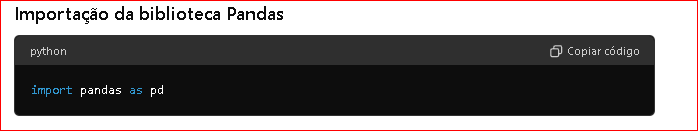

# Conteúdo Gerado pelo prompt de desenvolvimento

## PROMPTS

### Primeiro

Como Utilizar Pandas para Transformar Dados em Insights Poderosos

Bloco 1: O que é o Pandas?
O Pandas é como uma caixa de ferramentas mágica para cientistas de dados. Ele te ajuda a organizar e mexer com dados de um jeito que faz parecer super fácil. Por exemplo, imagine que você tem uma lista gigante de notas de provas de uma turma. Com o Pandas, você pode ver quem tirou as notas mais altas ou mais baixas rapidinho!

Bloco 2: Como o Pandas ajuda a encontrar padrões?
O Pandas pode mostrar padrões escondidos nos dados. Por exemplo, você tem dados de vendas de uma loja ao longo do ano. Com Pandas, você pode descobrir qual foi o mês em que a loja vendeu mais produtos ou qual foi o dia mais movimentado da semana.

Bloco 3: Transformando dados para contar histórias
Com o Pandas, você pode transformar números chatos em histórias interessantes. Por exemplo, se você tem dados de um jogo, Pandas pode te mostrar quantos jogadores preferem cada personagem ou qual fase do jogo é mais difícil para os jogadores.

Bloco 4: Descobrindo relações entre diferentes variáveis
Uma das coisas legais do Pandas é que ele pode te mostrar como uma coisa está relacionada com outra. Por exemplo, se você tem dados sobre altura e peso de pessoas, o Pandas pode te dizer se pessoas mais altas geralmente pesam mais ou não.

Call to Action:
Espero que tenha gostado de aprender sobre como o Pandas pode ser legal para analisar dados! Se quiser mais dicas e truques sobre ciência de dados, me siga nas redes sociais. Vamos explorar juntos o mundo dos dados! 🚀

Hashtags:
#DataScience #Pandas #AnáliseDeDados


## SEGUNDO
```sh
PROMPT 
```
Crie como seria a implemtanção deste bloco: Transformando dados para contar histórias
Com o Pandas, você pode transformar números chatos em histórias interessantes. Por exemplo, se você tem dados de um jogo, Pandas pode te mostrar quantos jogadores preferem cada personagem ou qual fase do jogo é mais difícil para os jogadores.


* RESULTADO

import pandas as pd

# Exemplo de dados fictícios de um jogo
dados_jogo = {
    'Jogador': ['Ana', 'João', 'Maria', 'Pedro', 'Julia', 'Carlos', 'Laura', 'Mariana', 'Felipe', 'Sofia'],
    'Personagem': ['A', 'B', 'A', 'C', 'B', 'C', 'A', 'B', 'C', 'A'],
    'Fase': [1, 2, 3, 1, 2, 3, 1, 2, 3, 1],
    'Pontuação': [100, 95, 110, 98, 102, 115, 105, 100, 112, 108]
}

# Criando um DataFrame com os dados
df = pd.DataFrame(dados_jogo)

# Contando quantos jogadores preferem cada personagem
preferencias = df['Personagem'].value_counts()

# Mostrando a contagem de preferências
print("Quantidade de jogadores por personagem:")
print(preferencias)
print()

# Encontrando a fase mais difícil para os jogadores
media_por_fase = df.groupby('Fase')['Pontuação'].mean()
fase_dificil = media_por_fase.idxmin()

# Mostrando a fase mais difícil
print(f"A fase mais difícil para os jogadores é a fase {fase_dificil}")


```sh
PROMPT 
```
Explicação do código:

Importação da biblioteca Pandas: import pandas as pd - Isso importa o Pandas e permite que você use suas funcionalidades para análise de dados.

Criando os dados fictícios: dados_jogo é um dicionário que contém informações fictícias sobre jogadores, personagens que preferem, fase em que estão e pontuações.

Criando um DataFrame: df = pd.DataFrame(dados_jogo) - Isso cria um DataFrame do Pandas com base nos dados fictícios.

Contando quantos jogadores preferem cada personagem: preferencias = df['Personagem'].value_counts() - Aqui, usamos value_counts() para contar quantos jogadores preferem cada personagem do jogo.

Mostrando a contagem de preferências: print(preferencias) - Isso exibe a contagem de quantos jogadores preferem cada personagem.

Encontrando a fase mais difícil para os jogadores:

media_por_fase = df.groupby('Fase')['Pontuação'].mean() agrupa os dados por fase e calcula a média das pontuações em cada fase.
fase_dificil = media_por_fase.idxmin() encontra o índice (número da fase) onde a média das pontuações é mínima, ou seja, a fase mais difícil.
Mostrando a fase mais difícil: print(f"A fase mais difícil para os jogadores é a fase {fase_dificil}") - Isso exibe qual fase é considerada a mais difícil pelos dados analisados.

Este exemplo ilustra como o Pandas pode ser usado para transformar dados numéricos em insights interessantes e compreensíveis, como preferências por personagem em um jogo e identificação da fase mais desafiadora para os jogadores.


### TERCEIRO
```sh
PROMPT 
```

Detalhe um pouco os comandos e funções usadas e cite durante o detalhe outras aplicações

Claro! Vamos detalhar os comandos e funções usadas no exemplo anterior, destacando suas aplicações e possíveis variações:



import pandas as pd


Detalhe: import pandas as pd importa a biblioteca Pandas e a renomeia como pd, facilitando o acesso às suas funções.

Outras aplicações: Pandas é amplamente utilizado para manipulação e análise de dados em Python. Além de criar DataFrames como no exemplo, também pode ser usado para ler arquivos CSV, Excel, SQL, entre outros, e manipular grandes conjuntos de dados de maneira eficiente.

### Criando os dados fictícios


 código

dados_jogo = {
    'Jogador': ['Ana', 'João', 'Maria', 'Pedro', 'Julia', 'Carlos', 'Laura', 'Mariana', 'Felipe', 'Sofia'],
    'Personagem': ['A', 'B', 'A', 'C', 'B', 'C', 'A', 'B', 'C', 'A'],
    'Fase': [1, 2, 3, 1, 2, 3, 1, 2, 3, 1],
    'Pontuação': [100, 95, 110, 98, 102, 115, 105, 100, 112, 108]
}
Detalhe: dados_jogo é um dicionário Python que contém quatro listas correspondentes aos dados dos jogadores, personagens, fases e pontuações.

Outras aplicações: Pandas permite a criação de DataFrames não apenas a partir de dicionários, mas também de listas, arrays NumPy, e até de consultas a bancos de dados. Isso é útil em projetos de análise de dados que requerem importação e estruturação de dados de diversas fontes.


### Criando um DataFrame


código

df = pd.DataFrame(dados_jogo)
Detalhe: pd.DataFrame() converte o dicionário dados_jogo em um DataFrame do Pandas chamado df.


Outras aplicações: Além de criar DataFrames a partir de dicionários, Pandas permite a concatenação de múltiplos DataFrames, junção de tabelas, e reshaping (mudança de formato) de dados, facilitando a organização e análise de grandes volumes de informações estruturadas.

### Contando quantos jogadores preferem cada personagem


código

preferencias = df['Personagem'].value_counts()
Detalhe: df['Personagem'] 

seleciona a coluna 'Personagem' do DataFrame df, e .value_counts() conta quantas vezes cada valor aparece nessa coluna.

Outras aplicações: Esta função é útil para análise de frequência de dados categóricos, como preferências de produto em vendas, categorias de clientes em marketing, entre outros.

### Encontrando a fase mais difícil para os jogadores


 código


media_por_fase = df.groupby('Fase')['Pontuação'].mean()
fase_dificil = media_por_fase.idxmin()


Detalhe: df.groupby('Fase')['Pontuação'].mean() agrupa os dados pelo valor da coluna 'Fase', calcula a média das pontuações de cada grupo e armazena em media_por_fase. idxmin() encontra o índice (número da fase) onde a média das pontuações é mínima.

Outras aplicações: A função groupby() é essencial para resumir dados em diferentes categorias, sendo útil em análises que envolvem segmentação de mercado, análise temporal, entre outros. idxmin() e idxmax() são frequentemente usados para identificar valores mínimos e máximos em séries de dados.


### Conclusão

O Pandas é uma poderosa ferramenta para análise de dados em Python, oferecendo diversas funções que permitem desde a importação e manipulação de dados até a análise estatística e visualização. Se você quer aprender mais sobre como transformar dados em histórias interessantes, siga explorando o mundo da ciência de dados e compartilhe suas descobertas nas redes sociais! 🚀

Hashtags:
#DataAnalysis #Python #Pandas


### RESULTADO:


Bloco 1: O que é o Pandas?
O Pandas é como uma caixa de ferramentas mágica para cientistas de dados. Ele te ajuda a organizar e mexer com dados de um jeito que faz parecer super fácil. Por exemplo, imagine que você tem uma lista gigante de notas de provas de uma turma. Com o Pandas, você pode ver quem tirou as notas mais altas ou mais baixas rapidinho!

História do Pandas
O Pandas foi criado em 2008 por Wes McKinney, um cientista de dados que queria uma ferramenta mais eficiente para trabalhar com dados financeiros em Python. Desde então, ele se tornou uma das bibliotecas mais populares para análise de dados, sendo amplamente utilizado em diversas áreas, como finanças, ciência, saúde e muito mais.

Aplicações em Diferentes Linguagens
Embora o Pandas tenha sido desenvolvido para Python, conceitos similares podem ser encontrados em outras linguagens. Por exemplo, o R tem pacotes como dplyr e data.table que oferecem funcionalidades semelhantes para manipulação de dados. Em Julia, a biblioteca DataFrames.jl é usada para manipulação de dados de maneira similar ao Pandas.

Desenvolvimento Contínuo
O Pandas está em constante desenvolvimento. A comunidade ativa de desenvolvedores continua a adicionar novas funcionalidades e melhorar a performance da biblioteca. Atualizações frequentes garantem que o Pandas esteja sempre alinhado com as necessidades atuais da análise de dados. Recentemente, têm sido feitos esforços para melhorar a compatibilidade com grandes volumes de dados e integrar melhor com outras bibliotecas populares, como NumPy e Dask, expandindo ainda mais suas capacidades.

Conclusão
O Pandas transforma a análise de dados, facilitando tarefas complexas e permitindo que cientistas de dados concentrem seus esforços em extrair insights valiosos. Quer aprender mais sobre Pandas e outras ferramentas incríveis para análise de dados? Siga-me nas redes sociais e fique por dentro das últimas novidades! 🚀

Hashtags:
#DataScience #Pandas #AnáliseDeDados
